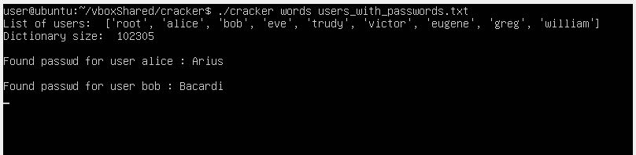

# Cracker

A simple dictionary based attack script for cracking un-shadowed linux password hashes.
Developed in python. Expected to work on Linux.
- note: Will **NOT** work on windows due to issues with multiprocessing.
- note: All files for set-up or execution are located at root of cracker folder.

## Features

- Contains implementation for all Linux Hashes (md5, blowfish, eksblowfish, sha256, sha512)
    - Tested and verified for sha512
- Uses multi-threading:
    - Splits the dictionary between all available cores
    - Checks each password against all users in parallel
    - note: allows unrestricted core usage. may lead to near 100% CPU utilization.
- Dictionary and password files are searched relative to current working directory

## Dependencies:

- Python 3 
- passlib

## Setup

- Easiest way to install all dependencies is to run the setup script 
```setup_script
./setup
```
 - Alternatively, you can manually install python 3 and passlib.

note: May prompt for sudo password during installation

## Usage

```cracker_script
./cracker <dictionary_file> <linux_password_file>
```
or you can directly run the python file with
```python_script
python3 main.py <dictionary_file> <linux_password_file>
```

## Sample Output



## TODO

- Windows compatibility
- Error Handling
- Further optimizations
- Testing hashes other than sha512
- GPU support maybe?
- Attack modes other than dictionary

